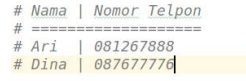
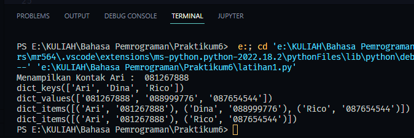
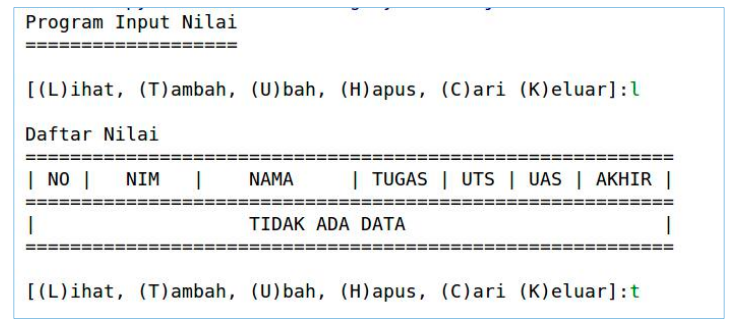
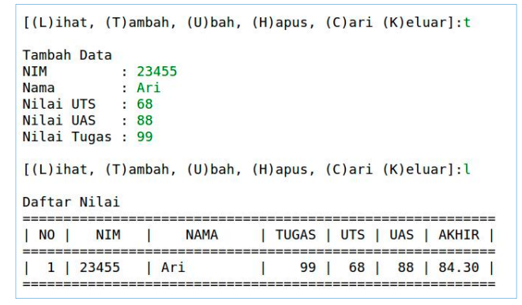
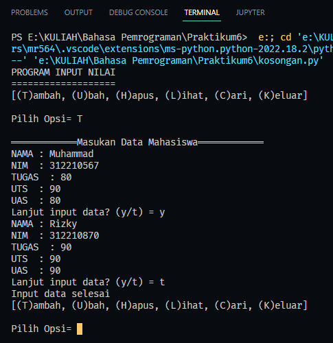
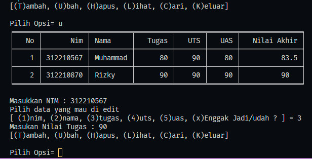
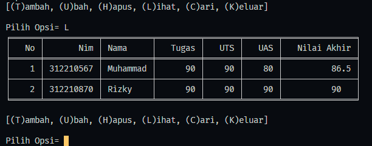
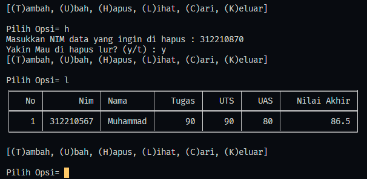
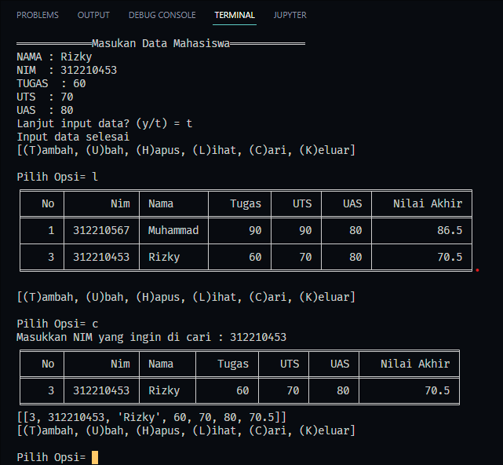

# Tugas Python Pertemuan 10
___
Nama    : Muhammad Rizky<br>
NIM     : 312210576<br>
Kelas   : TI.22.B2<br>
Mapel   : Bahasa Pemrograman<br>

**Daftar isi**
> * [Latihan Module 1](#latihan-module-1)
> * [Tugas Praktikum](#tugas-praktikum)

# `Latihan Module 1`
• Buat Dictionary daftar kontak<br>
> • Nama sebagai key, dan nomor sebagai value<br>
> <br>
• Tampilkan kontaknya Ari<br>
• Tambah kontak baru dengan nama Riko, nomor 087654544<br>
• Ubah kontak Dina dengan nomor baru 088999776<br>
• Tampilkan semua Nama<br>
• Tampilkan semua Nomor<br>
• Tampilkan daftar Nama dan nomornya<br>
• Hapus kontak Dina<br>


```python
    # Buat Dictionary daftar kontak
    # (Note) Nama sebagai key, dan nomor sebagai value
    daftarKontak = {'Ari': '081267888', 'Dina': '081267888'}

    # Tampilkan kontaknya Ari
    print('Menampilkan Kontak Ari : ', daftarKontak['Ari'])

    # Tambah kontak baru dengan nama Riko, nomor 087654544
    daftarKontak['Rico'] = "087654544"
    # Ubah kontak Dina dengan nomor baru 088999776
    daftarKontak['Dina'] = "088999776"

    # Tampilkan semua Nama
    print(daftarKontak.keys())
    # Tampilkan semua Nomor
    print(daftarKontak.values())
    # Tampilkan daftar Nama dan nomornya
    print(daftarKontak.items())

    # Hapus kontak Dina
    del daftarKontak['Dina']
    print(daftarKontak.items())
```



# `Tugas Praktikum`
Buat program sederhana yang akan menampilkan daftar nilai mahasiswa, dengan ketentuan : <br>
> • Program dibuat dengan menggunakan Dictionary<br>
> • Tampilkan menu pilihan: (Tambah Data, Ubah Data, Hapus Data, Tampilkan Data, Cari Data)<br>
> • Nilai Akhir diambil dari perhitungan 3 komponen nilai (tugas: 30%, uts: 35%, uas: 35%)<br>
> • Buat flowchart dan penjelasan programnya<br>




## `Flowchart`

## `Code`
```python
    from tabulate import tabulate

dataMahasiswa = {}
no = 0

print("PROGRAM INPUT NILAI")
print("===================")

while True:

    print("[(T)ambah, (U)bah, (H)apus, (L)ihat, (C)ari, (K)eluar]")
    pilihan = input("\nPilih Opsi= ")

# =====================================PROGRAM INPUT DATA========================================

    if pilihan.lower() == "t":
        print ("\n════════════Masukan Data Mahasiswa════════════")
        loop = "y"
        while(loop == "y"):
            while (True):
                nama = input("NAMA : ")
                if nama == '':
                    print ('Nama tidak boleh kosong')
                else:
                    break
            while (True):
                try:
                    nim  = int(input("NIM  : "))
                    if nim == '':
                        print ('Masukan Nim dengan Angka')
                except ValueError:
                    print ('Masukan Nim dengan Angka')
                else:
                    break
            while (True):
                try:
                    tugas  = int(input("TUGAS  : "))
                    if tugas == '':
                        print ('Masukan TUGAS dengan Angka')
                except ValueError:
                    print ('Masukan TUGAS dengan Angka')
                else:
                    break
            while (True):
                try:
                    uts  = int(input("UTS  : "))
                    if uts == '':
                        print ('Masukan UTS dengan Angka')
                except ValueError:
                    print ('Masukan UTS dengan Angka')
                else:
                    break
            while (True):
                try:
                    uas  = int(input("UAS  : "))
                    if uas == '':
                        print('Masukan UAS dengan Angka')
                except ValueError:
                    print ('Masukan UAS dengan Angka')
                else:
                    break
            akhir = round(tugas * 30 / 100) + (uts * 35 / 100) + (uas * 35 / 100)
            no += 1
            dataMahasiswa[nim] = [no,nim,nama,tugas,uts,uas,akhir]
            loop = input("Lanjut input data? (y/t) = ")
        while(loop == "t"):
            print("Input data selesai")
            break

# =====================================PROGRAM UBAH DATA========================================

    elif pilihan.lower() == 'u':
        list = (dataMahasiswa.values())
        print(tabulate(list, headers=[
            "No", "Nim", "Nama", "Tugas", "UTS", "UAS", "Nilai Akhir"], tablefmt="fancy_grid"))
        print("")
        nims = int(input('Masukkan NIM : '))

        if nims in (dataMahasiswa.keys()):

            print('Pilih data yang mau di edit')
            edit = input('[ (1)nim, (2)nama, (3)tugas, (4)uts, (5)uas, (x)Enggak Jadi/udah ? ] = ')
            if edit == '1':
                # Belum jadi yg nim
                newNim = int(input("Masukan NIM Baru : "))  
                dataMahasiswa[nims][1] = newNim
            elif edit == '2' :
                newNama = (input("Masukan Nama : "))
                dataMahasiswa[nims][2] = newNama
            elif edit == '3' :
                newTugas = float(input("Masukan Nilai Tugas : "))
                dataMahasiswa[nims][3] = newTugas
                akhir = round(dataMahasiswa[nims][3] * 30 / 100) + (dataMahasiswa[nims][4] * 35 / 100) + (dataMahasiswa[nims][5] * 35 / 100)
                dataMahasiswa[nims][6] = akhir
            elif edit == '4' :
                newUts = float(input("Masukan Nilai UTS : "))
                dataMahasiswa[nims][4] = newUts
                akhir = round(dataMahasiswa[nims][3] * 30 / 100) + (dataMahasiswa[nims][4] * 35 / 100) + (dataMahasiswa[nims][5] * 35 / 100)
                dataMahasiswa[nims][6] = akhir
            elif edit == '5' :
                newUas = float(input("Masukan Nilai Uas : "))
                dataMahasiswa[nims][5] = newUas
                akhir = round(dataMahasiswa[nims][3] * 30 / 100) + (dataMahasiswa[nims][4] * 35 / 100) + (dataMahasiswa[nims][5] * 35 / 100)
                dataMahasiswa[nims][6] = akhir
        else:
            print("Nik lu belum ada lur")

# =====================================PROGRAM HAPUS DATA========================================
    elif pilihan == 'h' :   
            nims = int(input('Masukkan NIM data yang ingin di hapus : '))

            if nims in (dataMahasiswa.keys()):
                exekusi = input('Yakin Mau di hapus lur? (y/t) : ')
                if exekusi == 'y':
                    del dataMahasiswa[nims]
                else :
                    print("Data enggak jadi di hapus lur")
            else :
                print("NIM yang lu input enggak ada lur")  

# =====================================PROGRAM LIST DATA========================================
    elif pilihan.lower() == 'l':
        list = (dataMahasiswa.values())
        print(tabulate(list, headers=[
            "No", "Nim", "Nama", "Tugas", "UTS", "UAS", "Nilai Akhir"], tablefmt="fancy_grid"))
        print("")

# =====================================PROGRAM CARI DATA========================================
    elif pilihan.lower() == 'c' :   
            nims = int(input('Masukkan NIM yang ingin di cari : '))
            if nims in (dataMahasiswa.keys()):
                list = []
                list.append([dataMahasiswa[nims][0],dataMahasiswa[nims][1],dataMahasiswa[nims][2],dataMahasiswa[nims][3],dataMahasiswa[nims][4],dataMahasiswa[nims][5],dataMahasiswa[nims][6]])
                print(tabulate(list, headers=[
                "No", "Nim", "Nama", "Tugas", "UTS", "UAS", "Nilai Akhir"], tablefmt="fancy_grid"))
                print(list)

# =====================================PROGRAM Keluar ========================================

    elif pilihan.lower() == 'k' :
        print("dadah lur")
        print('')
        print('')
        print('')
        break

    else :
        print (" __________________________")
        print ("| Pilih opsi yang tersedia |")
        print (" ‾‾‾‾‾‾‾‾‾‾‾‾‾‾‾‾‾‾‾‾‾‾‾‾‾‾")

```
## `Hasil`
### Menambahkan Data

### Mengubah Data

### Melihat data

### Menghapus Data

### Mencari Data


### Terimakasih...